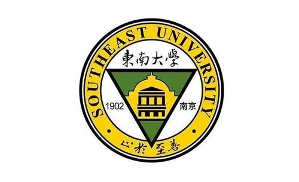
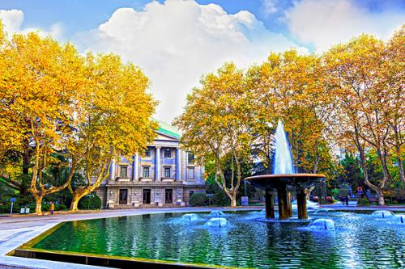
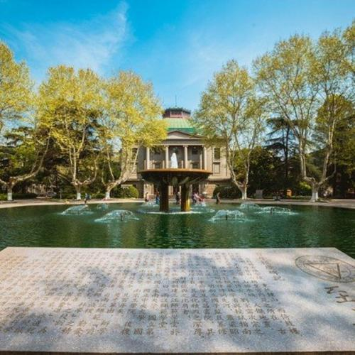
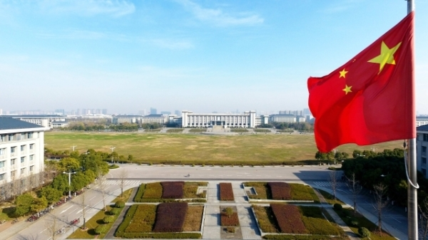

# Southeast University

Southeast University is located in Nanjing, the ancient capital of the Six Dynasties, and is a well-known institution of higher learning at home and abroad. The school is a national key university directly under the Ministry of Education and jointly established with Jiangsu Province. It is one of the key universities in the national "985 Project" and "211 Project". In 2017, Southeast University was selected into the list of Class A universities for world-class university construction.

Southeast University is a university with a long history and profound heritage. The school was founded in 1902 in Sanjiang Normal School, and has gone through important development periods such as Liangjiang Normal School, Nanjing Higher Normal School, National Southeast University, and National Central University. In 1952, the colleges and departments of the country were adjusted, and the liberal arts and sciences of the school moved out, with the former National Central University Engineering College as the main body, and successively merged into the related departments of Fudan University, Jiaotong University, Zhejiang University, Jinling University, etc., in the National Central University Nanjing Institute of Technology was established on the original site of the headquarters. In May 1988, the school was renamed Southeast University. In April 2000, the former Southeast University, Nanjing Railway Medical College, and Nanjing Transportation Technical College merged, and Nanjing School of Geology merged to form a new Southeast University. In the course of nearly 120 years of running a school, Southeast University has always been mindful of the world and the motherland, constantly striving for self-improvement and pursuing excellence for scientific progress and national rejuvenation, and has gradually formed an excellent school spirit of "rigorous, truth-seeking, unity, and forging ahead" and "using science". The school-running philosophy of being famous and serving the country with talents has created the school motto of "stopping at perfection".

Southeast University currently has 34 departments, 83 undergraduate majors, 34 first-level discipline authorization points for doctoral degrees, and 48 first-level discipline authorization points for master's degrees. There are 36,277 full-time students, including 16,200 undergraduates and 20077 postgraduates; 1966 international students, including 1,523 foreign students with academic qualifications. The school has four campuses, Jiulong Lake, Dingjiaqiao and other campuses, covering an area of ​​5,888 acres, of which the Jiulong Lake campus is 3,752.35 acres, with a total construction area of ​​about 789,700 square meters. The school library covers an area of ​​66,900 square meters, with a collection of 4.45 million books and materials. The school also has Wuxi branch and Suzhou campus.

Southeast University is a comprehensive, research-oriented university with engineering as its main feature, covering philosophy, economics, law, education, literature, science, engineering, medicine, management, art and many other disciplines. The school’s 11 disciplines were selected into the national “Double First-Class” construction discipline list, and 5 disciplines received A+ in the fourth round of discipline evaluation, both ranked eighth in the country; 12 disciplines entered the ESI world’s top 1percent, of which engineering was ranked 20, computer science ranks 16th, these two disciplines are in the top 1‰ of the ESI world. The school has 3 national key laboratories, 4 national engineering research centers, 2 national engineering technology research centers, 1 national professional laboratory, 11 key laboratories of the Ministry of Education, 7 engineering research centers of the Ministry of Education, 33 post-doctoral fellows Research mobile stations, as well as 1 national-level liberal arts think tank and 2 key high-end think tanks in Jiangsu Province.

Southeast University has a high-level faculty. The school has 2,91 full-time teachers, including 2,569 teachers with doctoral degrees, 2021 teachers with senior and deputy titles; 1071 doctoral instructors, and 2,166 master instructors. There are 12 academicians of the two academies, 1 academician of the European Academy of Sciences, 13 members of the 7th Disciplinary Review Group of the Academic Degrees Committee of the State Council, 37 national "Ten Thousand Talents Program" experts, 6 national-level teaching teachers award winners, "Ten Thousand Talents Program" There are 5 famous teaching teachers, 63 professors in the "Changjiang Scholars Award Program", 50 winners of the National Science Fund for Outstanding Youth, 25 national candidates for the "Hundred, Thousand, Thousand Talents Project" of the Ministry of Personnel, and 2 national top ten young jurists. Southeast University is deepening the strategy of strengthening the school with talents, vigorously promoting the "high-end teacher doubling plan", and speeding up the construction of a first-class teaching staff.

Southeast University has an outstanding reputation in education and teaching. The school has always regarded talent training as the fundamental task of running a school. Over the past century, it has trained 350,000 outstanding talents for the country and society, and a large number of outstanding elites have emerged. The academicians of the two academies who have worked or studied at Southeast University have More than 200 people. The school is the first batch of national-level innovation and entrepreneurship education reform demonstration universities, and the first batch of "three holistic education" comprehensive reform pilot universities by the Ministry of Education. A total of 20 majors were selected as national first-class undergraduate majors, 5 majors were selected as national comprehensive reform pilot projects, 23 majors were selected as national characteristic majors, 36 first batch of national quality resource sharing courses, 11 national quality courses Online open courses, 5 national virtual simulation experimental teaching projects, 8 national experimental teaching demonstration centers and construction sites, and 3 national virtual simulation experimental teaching centers. In 2018, 50 people were selected as members of the new National Teaching Steering Committee, including 3 directors and 10 deputy directors. The school has 12 national-level talent training model innovation experimental areas, 12 national-level engineering practice education centers, and 11 teams are selected as national-level teaching innovation teams. Southeast University has won the first prize of National Teaching Achievement for four consecutive sessions (every four years). Among them, it won 9 National Teaching Achievement Awards in 2018, ranking third in the country. In the new era, Southeast University insists on fostering morality, inheriting fine traditions, advancing with the times, reshaping the goal of talent training, and striving to create leading talents with family and national sentiments and international perspectives who are responsible for leading the future and benefiting mankind.

Southeast University is an important base for scientific and technological research and radiation in my country. The school adheres to the integration of production, education and research. In 2019, the scientific research funds were 2.83 billion yuan, 3001 invention patents were applied for, 1,783 invention patents were authorized, and 105 PCT patents were applied. SCI and EI papers are included in the forefront of universities in the country. From 2011 to 2019, the school took the lead in winning 31 national science and technology awards, including one first prize for national technological invention in 2011 and one first prize for national scientific and technological progress in 2014. In recent years, the school has participated in the "Moon Exploration Project", "Three Gorges Project", "500m Aperture Radio Telescope", Beijing Sub-center, Hong Kong-Zhuhai-Macao Bridge, high-speed rail technology, Antarctic scientific research, South China Sea island building, wireless charging and other national major engineering. In the past five years, he took the lead in winning 20 Outstanding Achievement Awards in Humanities and Social Sciences of the Ministry of Education. Currently, Southeast University is striving to create a high-level technological innovation pattern to better serve the country's major development strategies.

Southeast University is one of the most active universities in my country for international exchanges and cooperation. The school has cooperated with the Massachusetts Institute of Technology, the University of California, Berkeley, the University of Maryland, the University of British Columbia, Canada, the University of British Columbia, the University of British Columbia, the University of Cambridge, the Imperial College of Technology, the University of Leeds, the University of Zurich, Switzerland, the Royal Institute of Technology in Sweden, the Technical University of Munich, Belgium. Wen University, Trinity College Dublin, Ireland, Monash University in Australia, Tokyo Institute of Technology in Japan and many other world-class universities and high-level research institutions have close cooperation and exchanges. Especially in 2017, Southeast University initiated the establishment of the "Sino-British University Engineering Education and Research Alliance", which is the first university alliance featuring engineering education and research established by China and the UK. Queen's University Belfast, Birmingham Nine well-known British universities including the University of Cambridge, University of Cambridge, Cardiff University, University of Leeds, University of Liverpool, University College London, University of Nottingham and University of Warwick have joined the alliance. The school also cooperated with Monash University in Australia to establish the Southeast University-Monash University Suzhou Joint Graduate School, which is the first Chinese-foreign joint graduate school approved by the Ministry of Education; and established Southeast University—Rennes in cooperation with Rennes University in France. A large graduate school. Southeast University is taking "global high-end, substantial cooperation and leading development" as its direction, and is accelerating the formation of a comprehensive, focused, multi-level, wide-ranging and high-level international exchange and cooperation pattern.

Step into a new era, stride on a new journey. Today’s Southeast University will adhere to Xi Jinping’s new era of socialism with Chinese characteristics as its guidance, uphold and practice the school motto of “Stop with the best”, establish first-class awareness, focus on first-class goals, implement first-class standards, and insist on aiming at the forefront, serving strategies, Teacher-student-oriented, talent first, promote multi-disciplinary integration, integration of science, engineering, literature and medicine, integration of production, education and research, and international alliances, comprehensively deepen comprehensive reforms, and strive to achieve major breakthroughs in talent training, scientific research, faculty, and international cooperation , Strive to build a world-class university with distinctive Chinese characteristics, Eastern atmosphere, and people’s satisfaction as soon as possible, and make outstanding contributions to the great rejuvenation of the Chinese nation and the advancement of human civilization. (Updated in March 2020)

