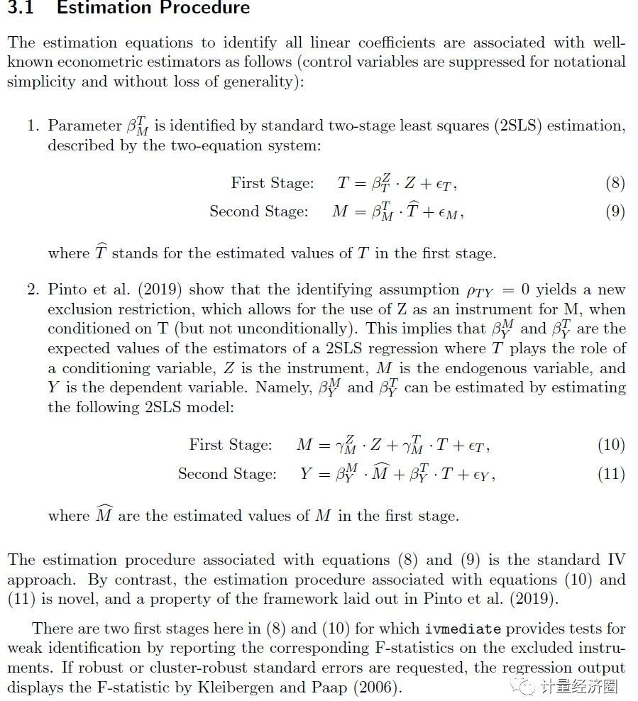

# learning

以下引荐的是"工具变量回归中的因果中介分析"，主要解决内生性处理变量和中介变量问题。

>Dippel C, Ferrara A, Heblich S. Causal mediation analysis in instrumental-variables regressions. The Stata Journal. 2020;20(3):613-626. doi:10.1177/1536867X20953572
In this article, we describe the use of ivmediate, a new command to estimate causal mediation effects in instrumental-variables settings using the framework developed by Dippel et al. (2020, unpublished manuscript). ivmediate allows estimation of a treatment effect and the share of this effect that can be attributed to a mediator variable. While both treatment and mediator can be potentially endogenous, a single instrument suffices to identify both the causal treatment and the mediation effects.

在了解“中介效应中的工具变量方法”前，先了解一些关于因果中介方法的介绍：①因果中介效应分析出现在顶刊, 是时候使用新方法了，②政策评估中"中介效应"因果分析, 增添了文献和Notes。
在许多情况下，研究人员希望了解处理变量X对结果变量Y的影响机制。例如，Becker和Woessmann（2009）对韦伯假设感兴趣，即宗教，特别是新教，影响经济增长。由于新教促进了圣经的阅读，他们认为宗教对经济增长影响的一个潜在机制是通过人力资本积累，特别是通过提高识字来发挥作用的。鉴于宗教在各地区的流行可能不是随机的，他们引入了一个工具变量（IV），并表明新教导致了较高的识字率，从而促进了经济增长。他们得出了中介作用范围的合理界限，但缺乏一个正式的因果框架来估计宗教对通过扫盲实现的经济增长的间接影响。
下面这篇文章和程序，主要针对“处理变量X和中介变量M可能内生的情况下，如何使用一个工具变量IV估计出直接效应和间接效应”。这种情况非常常见，就算没有M，处理变量X与结果变量Y之间可能因双向因果、测量误差等导致内生性问题。现在我们需要通过X——M——Y的路径，分离出中介效应和直接效应，若X和M可能是内生变量，那需要分别为X和M找一个工具变量进行估计吗？这两位同仁Markus Frölich和Martin Huber的"Direct and indirect treatment effects–causal chains and mediation analysis with instrumental variables"确实这么做的。但现在，Dippel等人在2019年的文章"Mediation Analysis in IV Settings With a Single Instrument"证明，一个工具变量IV就可以估计出因果中介效应。

估计环节如下，不过至于文章里的细节，各位学者可以在咱们社群里开展深入交流。

使用如下ivmediate程序所做的估计，其中工具变量为到Wittenberg的距离，因为距离这个地方越近，越容易因传教而成为新教徒，并最终通过提高识字率促进了经济增长。

估计的结果如下，但关于弱工具变量检验等被我们省略掉了。

上面这些文章和相关代码都可以自己下载尝试。

