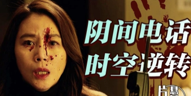

# Southeast University

**Nanjing University**, one of China`s key comprehensive universities under the direct supervision of the Ministry of Education, dates from **1902** when it was known as Sanjiang Normal School. During the following decades, it evolved as Liangjiang Normal School, Nanjing Higher Normal School, National Southeast University, the Fourth Zhongshan University, and National Central University. On August 8, 1949, National Central University was renamed National Nanjing University. In October **1950**, as required by the Ministry of Education, the name was changed to Nanjing University (NJU). In **1952**, due to the nationwide restructuring of colleges and universities, some academic units such as the School of Engineering and the School of Agriculture were separated from the university; meanwhile, it merged with the School of Liberal Arts and the School of Sciences of the University of Nanking founded in 1888. Its name remained while its campus moved from Sipailou to Gulou.

Today`s NJU consists of three beautiful campuses, Gulou, Pukou, and Xianlin. As a top university in China, it boasts advanced teaching and research facilities. Its current President is Dr. Chen Jun, a geochemist. Each year, the University celebrates its anniversary on May 20.

NJU`s development has always been closely linked with the destiny of China and its ever changing society. Nanjing Higher Normal School, the predecessor of NJU, played an important role in the upsurge of Chinese nationalism following the May Fourth Movement in 1919. In the early 1920s, a group of Chinese communist forerunners from this university introduced the theory of Marxism to the general public. The Second National Conference of Chinese Communist Youth League was also held here. During the Anti-Japanese War, Pan Shu, Liang Xi and Jin Baoshan, renowned professors from the university (then known as National Central University), organized the "Natural Sciences Forum" and the "Democracy and Science Forum," which eventually led to the founding of the democratic party "Jiu San Society." During the subsequent Liberation War, the university has always been at the forefront of fight for democracy and nationalism. On May 20, 1947, students from National Central University initiated an "Anti-Hunger, Anti-Civil War, and Anti-Persecution”bai campaign, later known as the "May 20th Patriotic Students Movement." Such a truth-seeking spirit has been carried forward to the era when the university was renamed Nanjing University. In May **1978**, one scholar from the Philosophy Department published in the Guangming Daily an article titled **"Practice Is the Sole Criterion for Testing Truth"** which evoked a heated discussion on the "criterion of truth" and attracted nationwide attention.

